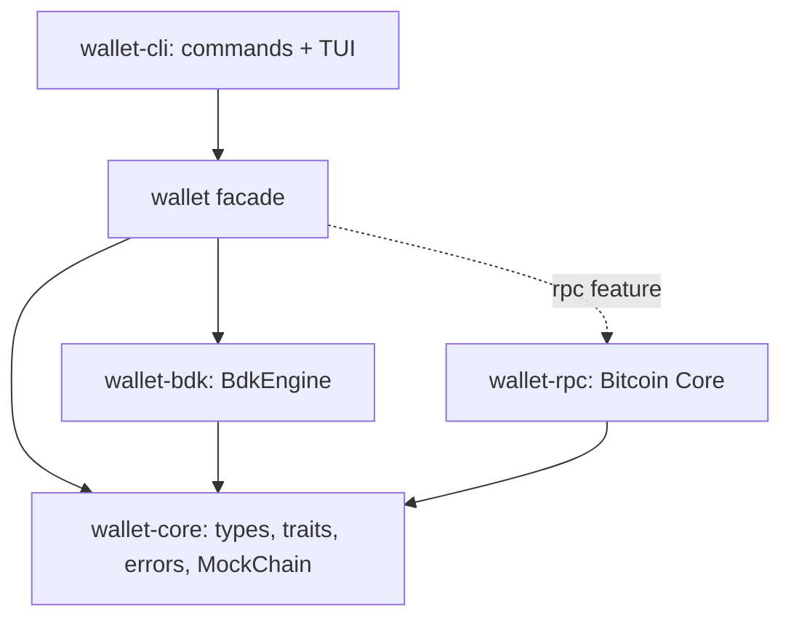

# Wallet_library

A small, modular Bitcoin wallet library in Rust, plus a CLI and a terminal UI built on it. The library handles key management, BIP84 address derivation, UTXO tracking, coin selection, PSBT building and signing, fee bumping and chain sync behind a typed API, so applications do not have to reimplement wallet logic.

Built for the Rust for Bitcoin cohort capstone (project 7: Wallet Library).

- **Non-custodial:** keys stay with the caller. The database never stores private keys, and BDK only ever sees public descriptors.
- **Pluggable:** the wallet engine and the chain backend are traits. v1 wraps `bdk_wallet`; a native engine is planned in [docs/v2](docs/v2/README.md).
- **Typed errors:** one error enum per operation, with structured data such as `InsufficientFunds { needed, available }`.
- **Works offline:** addresses, balances (as of the last sync) and signing never need a node.
- **Tested:** unit tests, a public API suite against an in-memory chain, doc examples, and end-to-end tests against a real regtest `bitcoind`.

**Contents:** [Try it](#try-it) · [Alice pays Bob](#alice-pays-bob) · [Requirements](#requirements) · [Running the app](#running-the-app) · [Guides](#guides) · [Using the library](#using-the-library) · [Examples](#examples) · [Development](#development)

## Try it

```bash
git clone <repo url> wallet_library && cd wallet_library
cargo wallet tui --demo
```

The first build downloads Bitcoin Core 29.0 once (for the demo node and tests), so it takes a few minutes. Then a throwaway regtest node starts, a wallet is created with fresh recovery words, and the terminal UI opens. Press `f` for coins, `3` to send, `m` to mine a block, `?` for every key, `q` to quit (which also stops the node). Nothing is kept.

## Alice pays Bob

Two wallets on one private regtest network, with nothing to install. In one command:

```bash
./scripts/regtest.sh demo
```

Or step by step (`cargo alice` and `cargo bob` are shortcuts for `cargo wallet --wallet alice` and `--wallet bob`):

```bash
cargo alice init                           # Alice's wallet, fresh recovery words
cargo bob init                             # Bob's wallet
cargo alice --node local mine 101          # coins for Alice (on the shared local node)
cargo bob address                          # copy Bob's address
cargo alice --node local send <bob's address> 250000
cargo alice --node local mine 1            # confirm it
cargo bob --node local history             # +250,000 sat, confirmed
```

Or in two terminals with the TUI: `cargo alice --node local tui` and `cargo bob --node local tui`; press `f` in Alice's, send to Bob's address from screen `3`, press `m` to confirm. Put `WALLET_NODE=local` in a `.env` (copy [`.env.example`](.env.example)) to drop `--node local` everywhere.

`--node local` runs one regtest `bitcoind` shared by all your wallets: started on demand, stopped when the last program using it exits. `./scripts/regtest.sh start` keeps it running instead, and `stop` stops it.

## Requirements

| Need | Why |
|---|---|
| Rust 1.88 or newer (`rustup update stable`) | edition 2024 |
| A C compiler (`sudo apt install build-essential` on Ubuntu/Debian, Xcode tools on macOS) | SQLite is compiled in |
| Internet on the first build | downloads `bitcoind` for the local node, the demo and tests |
| Bitcoin Core | only to use your own node (`--node external`); `--node local` and `--demo` start one for you |

## Running the app

The program is `wallet-cli`, built into `target/` (not installed). In this repo:

```bash
cargo wallet <command>          # any wallet, e.g. cargo wallet wallets
cargo alice <command>           # Alice's wallet
cargo bob <command>             # Bob's wallet
cargo wallet -w carol <command> # any other name
```

Elsewhere: `./target/debug/wallet-cli <command>`, or install it once with `cargo install --path crates/wallet-cli`. Cargo's own flags go before the alias (`cargo --offline wallet init`); don't repeat the program name (`cargo run wallet-cli init` fails).

## Guides

| Guide | Covers |
|---|---|
| [docs/CLI.md](docs/CLI.md) | every command and option, named wallets, the shared local node, `regtest.sh`, `.env`, JSON output, data on disk, troubleshooting |
| [docs/TUI.md](docs/TUI.md) | screens, keys, switching wallets, offline mode, quitting, `tui.toml` |
| [docs/architecture.md](docs/architecture.md) | crates, seams, data flows, error strategy, known behaviour |
| [docs/v2/README.md](docs/v2/README.md) | the plan for a native engine without BDK |

## Using the library

```toml
[dependencies]
wallet = { git = "<repo url>" }
```

```rust
use wallet::bitcoin::{Amount, FeeRate, Network};
use wallet::rpc::{RpcAuth, RpcClient};
use wallet::{KeySource, MnemonicLength, Recipient, Wallet, generate_mnemonic};

let node = RpcClient::new("http://127.0.0.1:18443", RpcAuth::Cookie("/path/to/.cookie".into()))?;

let mnemonic = generate_mnemonic(MnemonicLength::Words12)?;   // fresh every call
let mut wallet = Wallet::builder(Network::Regtest)
    .keys(KeySource::mnemonic(mnemonic.as_str()))
    .database("wallet.sqlite")
    .create_or_load()?;

let receive = wallet.new_address()?;          // next unused BIP84 address
wallet.sync(&node)?;                          // pull blocks and mempool
let balance = wallet.balance();               // confirmed, unconfirmed, immature

let to = "bcrt1q...".parse()?;
let fee_rate = FeeRate::from_sat_per_vb_u32(2);
let txid = wallet.send([Recipient::new(to, Amount::from_sat(50_000))], fee_rate, &node)?;
```

Handling errors by type:

```rust
match wallet.build_tx(recipients, fee_rate) {
    Ok(psbt) => { /* sign and broadcast */ }
    Err(BuildTxError::InsufficientFunds { needed, available }) => {
        println!("short by {}", needed - available);
    }
    Err(BuildTxError::WrongNetwork { address, expected }) => {
        println!("{address} is not a {expected} address");
    }
    Err(other) => return Err(other.into()),
}
```

| Method | Returns |
|---|---|
| `Wallet::builder(network).keys(..).database(..).create() / load() / create_or_load()` | `Wallet` |
| `generate_mnemonic(length)` / `validate_mnemonic(phrase)` | fresh 12/15/18/21/24-word phrase / check one |
| `new_address()` / `reveal_next_address()` | next unused / always-fresh receive address |
| `balance()` | `Balance { confirmed, unconfirmed, immature }` |
| `list_utxos()` / `transactions()` / `tx_status(txid)` | coins / history / confirmation state |
| `build_tx(recipients, fee_rate)` / `build_tx_with(&TxRequest)` | unsigned PSBT |
| `sign(&mut psbt)` | `Finalized` or `Partial` |
| `bump_fee(txid, fee_rate)` | replacement PSBT (RBF) |
| `track_pending(&tx)` | count a signed, not-yet-broadcast transaction (offline payments) |
| `sync(&source)` | `SyncReport` |
| `send(recipients, fee_rate, &broadcaster)` | build, sign and broadcast in one call |

Any `BlockSource` works for `sync`: `rpc::RpcClient`, `testkit::MockChain` for tests, or your own (see `custom_backend` below). Every public item is documented: `cargo doc -p wallet --open`.

### Architecture



Design, data flows, error strategy, TUI structure and known behaviour: [docs/architecture.md](docs/architecture.md).

## Examples

Each runs with no setup; CI runs them all.

| Example | Shows |
|---|---|
| `quickstart` | create, receive, sync, balance, build, sign, send |
| `custom_backend` | writing your own `BlockSource`, a logging decorator, runtime backend choice |
| `watch_only_signing` | watch-only wallet builds, offline wallet signs, PSBT as base64 |
| `error_handling` | matching on each typed error |
| `bump_fee` | replacing a stuck payment with a higher fee (RBF) |
| `regtest` | the full flow on Bitcoin Core (starts its own, or uses `WALLET_RPC_URL`) |

```bash
cargo run -p wallet --example quickstart
```

## Development

```bash
cargo test --workspace          # all tests, including regtest, CLI and TUI end-to-end ones
cargo clippy --workspace --all-targets --all-features -- -D warnings
cargo fmt --all
cargo doc --workspace --no-deps --open
```

## Roadmap

- v2: a native engine without BDK ([docs/v2](docs/v2/README.md))
- Esplora backend (a second `BlockSource`)
