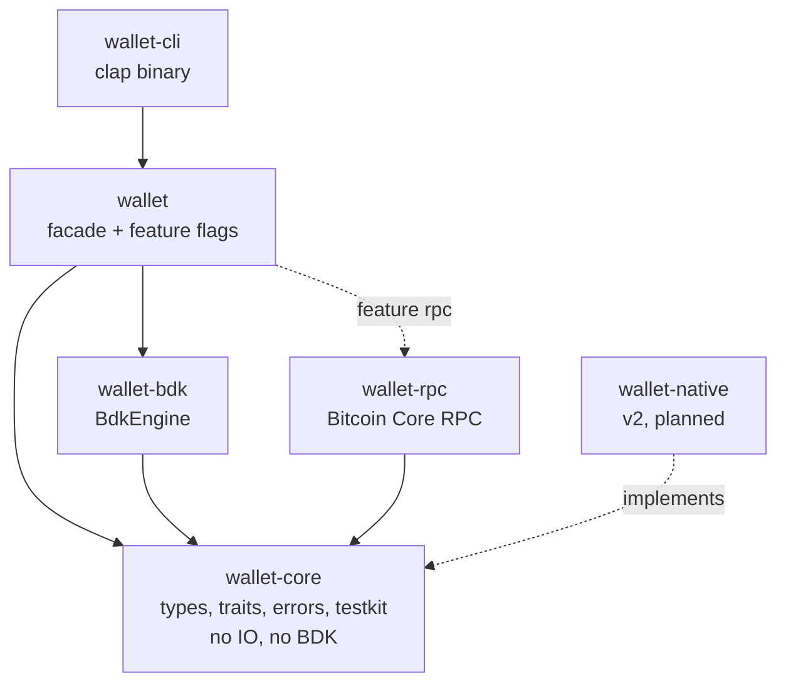
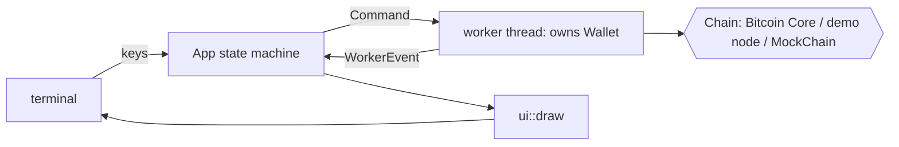

# Architecture (v1)

## Goal

A reusable Rust crate that gives applications non-custodial wallet functionality through a small, typed API. Wallet apps and CLIs build on it instead of reimplementing key management, address derivation, UTXO tracking, coin selection, signing and chain sync.

v1 wraps [`bdk_wallet`](https://docs.rs/bdk_wallet) as its engine. BDK is a private implementation detail: no `bdk_*` type appears in the public API. See [v2](v2/README.md) for the plan to replace it with a native engine.

## Crates



| Crate | Responsibility | Depends on |
|---|---|---|
| `wallet-core` | Domain types, the `WalletEngine` and chain traits, one error enum per operation, `MockChain` test kit | `bitcoin`, `thiserror`, `zeroize` |
| `wallet-bdk` | `BdkEngine`: implements `WalletEngine` with `bdk_wallet` and SQLite | `wallet-core`, `bdk_wallet` |
| `wallet-rpc` | `RpcClient`: implements `BlockSource`, `Broadcaster`, `FeeEstimator` over Bitcoin Core JSON-RPC | `wallet-core`, `bitcoincore-rpc` |
| `wallet` | Public entry point: `Wallet<E>`, `WalletBuilder`, re-exports, `rpc` and `serde` features | all of the above |
| `wallet-cli` | Demo binary; only uses the `wallet` facade | `wallet`, `clap`, `anyhow` |

**Dependency rule:** arrows point inward. `wallet-core` never imports an adapter, a database, a network client or BDK. The compiler enforces this, since `wallet-core` has no such dependencies to import.

## Seams

| Trait | Purpose | v1 implementations |
|---|---|---|
| `WalletEngine` | Wallet state machine: addresses, balance, UTXOs, build, sign, sync | `BdkEngine` |
| `BlockSource` | Blocks by height/hash plus mempool | `RpcClient`, `MockChain` |
| `Broadcaster` | Relay a signed transaction | `RpcClient`, `MockChain` |
| `FeeEstimator` | Fee rate for a confirmation target | `RpcClient`, `MockChain` |

The chain traits are object-safe and have blanket impls for `&T` and `Box<T>`, so a backend can be chosen at runtime as `Box<dyn BlockSource>`.

`BlockSource` is block-based on purpose. The engine receives full blocks and filters what is relevant itself, so the same source works for BDK today and a native engine later, and needs no address index or `txindex` on the node.

## Key custody

BDK only ever receives **public** descriptors. `BdkEngine` resolves the `KeySource` (mnemonic or descriptors) into public descriptors plus a private key map, and keeps the key map to itself. Signing uses `bitcoin::Psbt::sign` with that key map, then BDK's finalizer. This follows BDK 3's direction of moving key storage out of `Wallet`, and means a hardware or remote signer is a change inside the engine only.

- Secrets are held in `Zeroizing` buffers.
- `KeySource`'s `Debug` output is redacted (covered by a test).
- The SQLite database holds no private keys. Loading without keys opens the wallet watch-only.

## Data flows

**Sync**

1. Check the backend's genesis hash matches the wallet network (`SyncError::WrongChain` otherwise).
2. Walk the wallet's checkpoints down until one matches the backend's chain. Blocks above that point were reorged out.
3. Fetch each block from the agreement point (or the birthday height) to the tip and apply it with `apply_block_connected_to`.
4. Apply mempool transactions, and mark unconfirmed wallet transactions the node no longer has as evicted.
5. Persist, and return a `SyncReport`.

**Send**

```
build_tx(recipients, fee_rate)  ->  unsigned PSBT   (network check, coin selection, change)
sign(&mut psbt)                 ->  Finalized | Partial
psbt.extract_tx()               ->  Transaction
broadcaster.broadcast(&tx)      ->  Txid
```

`Wallet::send` chains all four.

## Errors

Every operation returns its own `thiserror` enum marked `#[non_exhaustive]`, so the type tells callers exactly what can fail:

| Operation | Error | Notable variants |
|---|---|---|
| create | `CreateError` | `InvalidMnemonic`, `InvalidDescriptor`, `AlreadyExists` |
| load | `LoadError` | `NotFound`, `NetworkMismatch { expected, found }`, `DescriptorMismatch` |
| sync | `SyncError` | `WrongChain`, `ApplyBlock { height, .. }`, `Source(SourceError)` |
| build_tx | `BuildTxError` | `InsufficientFunds { needed, available }`, `WrongNetwork`, `OutputBelowDust { index }`, `FeeTooLow` |
| track_pending | `TrackTxError` | `NotRelevant`, `Persist` |
| bump_fee | `BumpFeeError` | `NotFound(txid)`, `AlreadyConfirmed(txid)`, `NotReplaceable(txid)`, `FeeRateTooLow { required }` |
| sign | `SignError` | `WatchOnly`, `NothingToSign`, `InvalidPsbt` |
| broadcast | `BroadcastError` | `Rejected { reason }`, `Connection` |
| fee estimate | `FeeEstimateError` | `Unavailable { target_blocks }` |
| chain backend | `SourceError` | `HeightNotFound`, `BlockNotFound`, `Connection` (also on timeout) |

- Variants carry structured data, not strings.
- BDK and RPC errors are translated in one place per crate. Anything without a stable meaning is kept as `source()` inside an `Engine` or `Connection` variant, so the chain is never lost.
- `wallet::Error` unifies them for callers that just want `?`.

## Testing

| Layer | Where | Needs a node |
|---|---|---|
| Unit | `wallet-core`, `wallet-bdk` | No |
| Public API | `crates/wallet/tests/wallet.rs` against `MockChain` | No |
| Doc examples | every `Wallet` method | No |
| Examples | `crates/wallet/examples/*`, run in CI | Only `regtest`, which starts its own |
| End to end | `crates/wallet/tests/regtest.rs` against a real `bitcoind` | Downloaded automatically |
| CLI | key storage, encryption, session, argument parsing | No |
| TUI | validators, widgets, animation, keymap, worker, app state machine, rendering | No (`MockChain`) |
| TUI end to end | key presses through the real app and worker to a real `bitcoind` | Downloaded automatically |

The public API suite includes the BIP84 test vectors, reorg handling, every coin selection strategy, watch-only signing, persistence across reopen, fee bumping and each lifecycle error. The regtest suite covers receive, spend, confirm, coinbase maturity, typed node rejections, fee estimation on a fresh chain, a fee bump accepted by Bitcoin Core, and a real `invalidateblock` reorg.

Only one test uses a fixed mnemonic: the official BIP84 vector, which proves derivation matches the spec. Everything else generates fresh keys.

## Known behaviour

- **Reorged transactions stay pending.** A transaction whose block was orphaned becomes `Unconfirmed` rather than disappearing, matching a real node returning it to the mempool. BDK drops it only once something conflicts with it. Orphaned coinbases disappear entirely.
- **`reorg_depth` is an upper bound**, because the local chain keeps sparse checkpoints.
- **Birthday height is not persisted by the library.** It only matters for the first sync; the CLI stores it in `meta.json`.
- **Mempool scanning fetches every mempool transaction.** Fine for regtest and signet; mainnet would want a filtered source.

## TUI (`wallet-cli tui`)

The TUI uses only the `wallet` crate's public API, which shows the library is enough to build an app on.



| Module | Responsibility |
|---|---|
| `mod.rs` | terminal setup and the event loop; the only code doing terminal IO |
| `app.rs` | state machine: keys, events and ticks in, commands out; no IO, no clock reads |
| `worker.rs` | owns the wallet on a background thread so the UI never blocks |
| `message.rs` | `Command` and `WorkerEvent`, the only link between the two |
| `chain.rs` | node modes (external, managed regtest, none) plus a progress decorator for sync |
| `screens/` | one file per tab, all implementing the `Screen` trait |
| `startup.rs`, `modal.rs` | onboarding, unlock, and dialogs |
| `config.rs`, `theme.rs`, `keymap.rs` | every tunable value, color and key binding, as data |
| `validate.rs`, `widgets/` | reusable validators and the validated `Field` input |
| `format.rs`, `anim.rs` | display text and typed-error messages; spinner, tween, shimmer, toast timing |

**Adding a screen:** implement `Screen` in a new file under `screens/` and add one line to `screens::all`. **Adding a key:** add a row to `Keymap::default`; the footer and help pick it up. **Changing a color or interval:** `tui.toml`, no code change.

**Node modes.** `--node external` (your Bitcoin Core), `--node local` (one regtest `bitcoind` shared by all wallets, started on demand; each user holds a lease and the last one out stops it unless it was pinned with `node start`), `--node none` (offline), and `--demo` (a throwaway node). Quitting the TUI drops its worker and, with it, its lease. Opening a wallet never waits for the node: the worker reports `Connection::Online` or `Connection::Offline`, retries on an interval, and flips state whenever a call fails with a connection error. Offline, stored data is shown, fees fall back to the configured rate, and confirmed payments are signed, saved to `<datadir>/outbox/` and tracked with `Wallet::track_pending` (coins reserved, change pending). On reconnect the outbox is broadcast oldest first, before any sync, because a sync drops pending transactions the node has never seen.

**Shared by the CLI and the TUI:** `palette.rs` (every color, by role), `pager.rs` (page math), `node.rs` (`--node` modes, the shared local node with leases and pinning, the sync progress decorator), `wallets.rs` (named wallets, default, migration), `session.rs` (creating, unlocking and opening wallets). The CLI's printed output is built from `style.rs` (badges, labels, rules) and `activity.rs` (spinners and the sync progress bar, drawn on stderr and only in a terminal).

Key storage, unlocking and opening go through `wallet-cli`'s `session` module, which the CLI commands use too, so both front ends store and unlock keys the same way.
